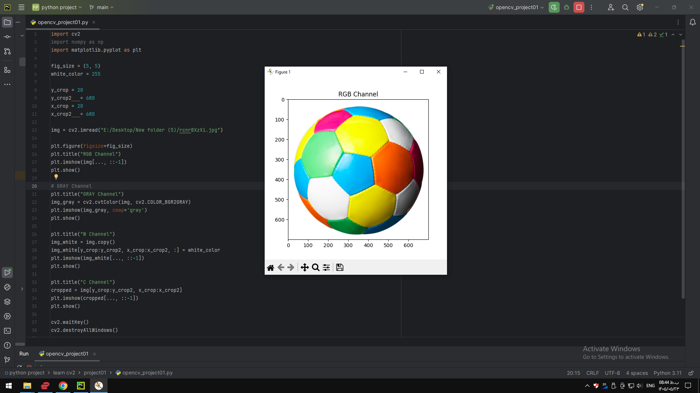

### Project 01 — `project01/README.md`

# Project 01 - Image Channels and Cropping

## Description

This project demonstrates basic image processing operations using OpenCV and Matplotlib.

The program loads an image, converts it to grayscale, changes a selected area to white, and crops a specific region of the image.

## Requirements

- Python
- OpenCV
- NumPy
- Matplotlib

## How to Run

python opencv_project01.py
## Output

