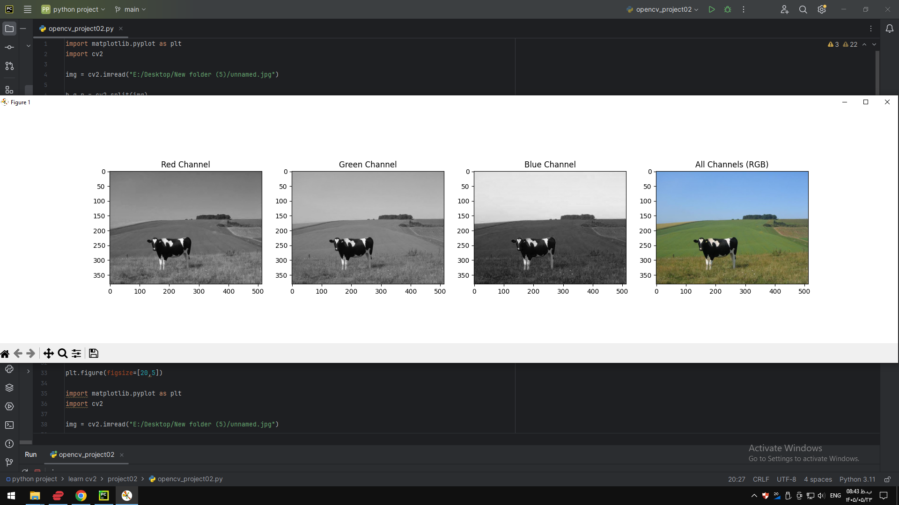

### Project 02 — `project02/README.md`

# Project 02 - RGB and HSV Channels

## Description

This project demonstrates how to separate and display the individual color channels of an image.

The program displays the Red, Green, and Blue channels and converts the image to HSV to display the Hue, Saturation, and Value channels.

## Requirements

- Python
- OpenCV
- Matplotlib

## How to Run

python opencv_project02.py
## Output

