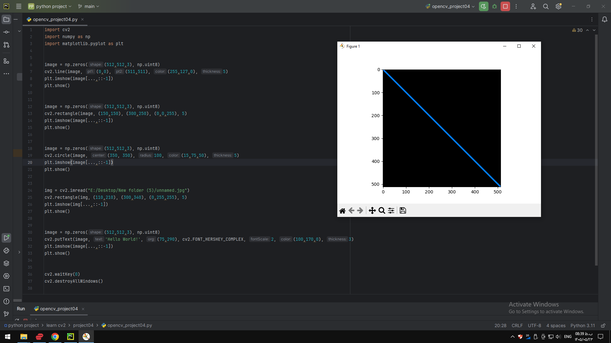

### Project 04 — `project04/README.md`

```markdown
# Project 04 - Drawing Shapes and Text

## Description

This project demonstrates how to draw different shapes and text using OpenCV.

The program creates images and draws lines, rectangles, circles, and text. It also demonstrates drawing a rectangle on an existing image.

## Requirements

- Python
- OpenCV
- NumPy
- Matplotlib

## How to Run

python opencv_project04.py

## Output



.png)

.png)

.png)

.png)