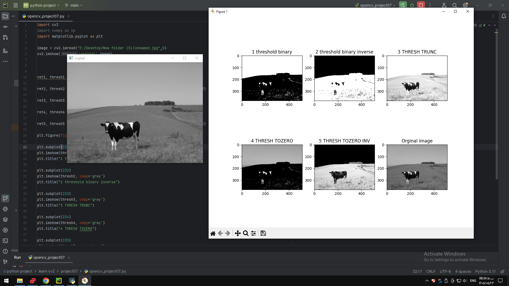

### Project 07 — `project07/README.md`

# Project 07 - Thresholding

## Description

This project demonstrates different thresholding methods available in OpenCV.

The program applies several thresholding techniques to a grayscale image and displays the results.

## Thresholding Methods

- Binary
- Binary Inverse
- Truncation
- To Zero
- To Zero Inverse

## Requirements

- Python
- OpenCV
- NumPy
- Matplotlib

## How to Run

python opencv_project07.py
## Output

