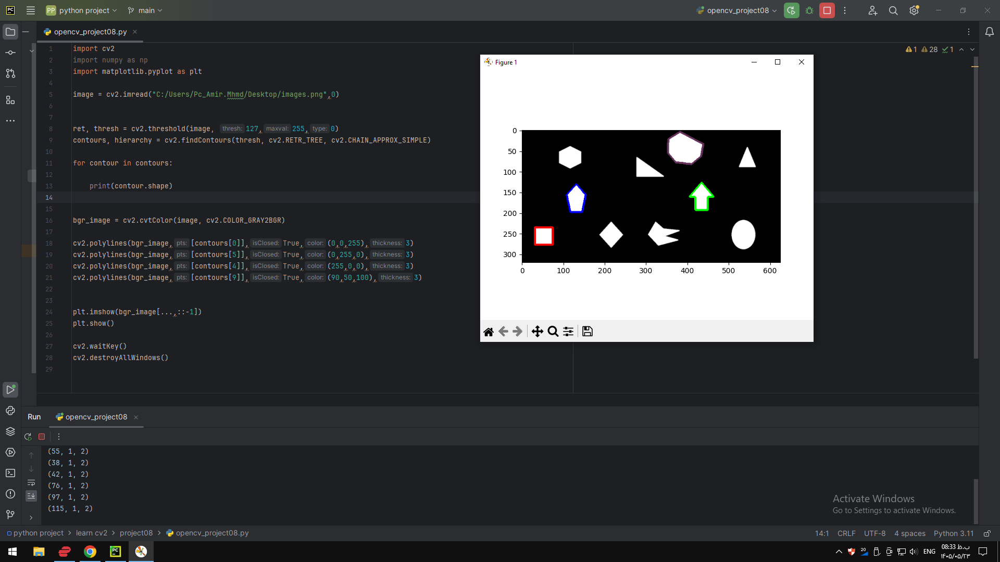

### Project 08 — `project08/README.md`

# Project 08 - Contours

## Description

This project demonstrates how to find and draw contours in an image using OpenCV.

The program detects contours from a thresholded image and draws selected contours on the image.

## Requirements

- Python
- OpenCV
- NumPy
- Matplotlib

## How to Run

python opencv_project08.py
## Output

