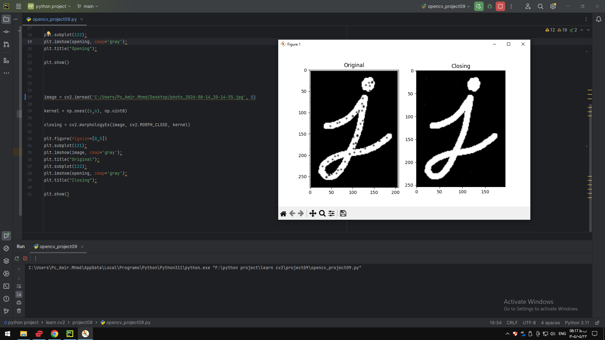

### Project 09 — `project09/README.md`

```markdown
# Project 09 - Morphological Operations

## Description

This project demonstrates morphological image processing operations using OpenCV.

The program applies morphological opening and closing operations to grayscale images.

## Operations

- Opening
- Closing

## Requirements

- Python
- OpenCV
- NumPy
- Matplotlib

## How to Run

python opencv_project09.py
## Output



