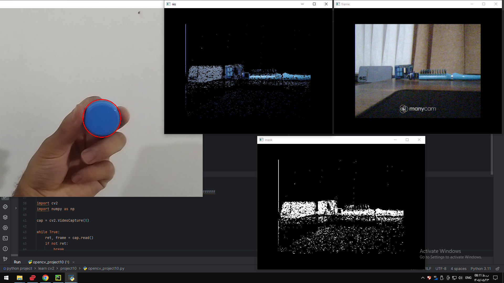

### Project 10 — `project10/README.md`

```markdown
# Project 10 - Blue Object Tracking

## Description

This project demonstrates basic color-based object tracking using OpenCV.

The program converts video frames to HSV, creates a mask for the blue color range, detects contours, and tracks the detected blue object.

The project includes examples using both a video file and a live camera.

## Requirements

- Python
- OpenCV
- NumPy
- Camera for live tracking

## How to Run

python opencv_project10.py
## Output

