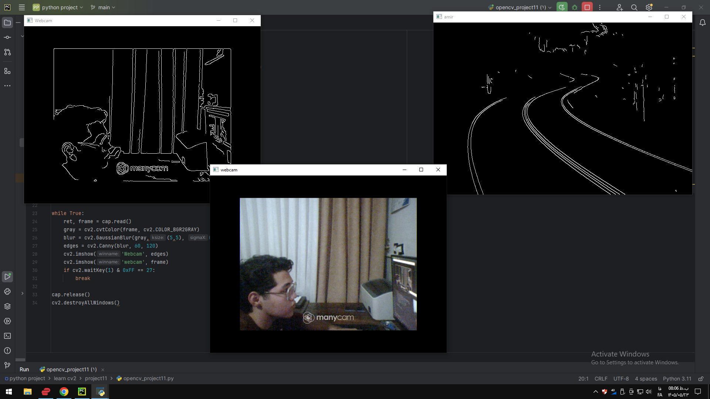

### Project 11 — `project11/README.md`

# Project 11 - Canny Edge Detection

## Description

This project demonstrates edge detection using the Canny algorithm with OpenCV.

The program applies grayscale conversion, Gaussian Blur, and Canny Edge Detection to an image and also performs real-time edge detection using a webcam.

## Requirements

- Python
- OpenCV
- NumPy
- Matplotlib

## How to Run

python opencv_project11.py
## Output

